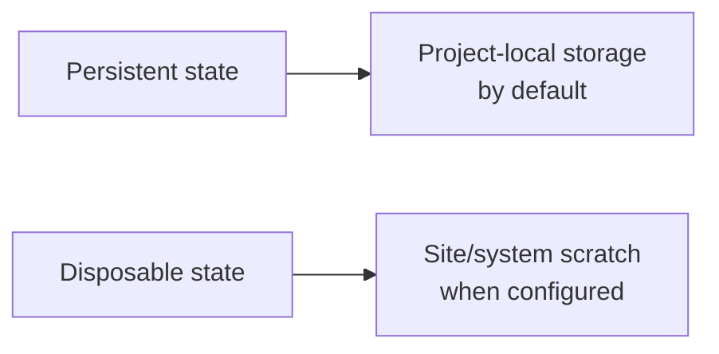
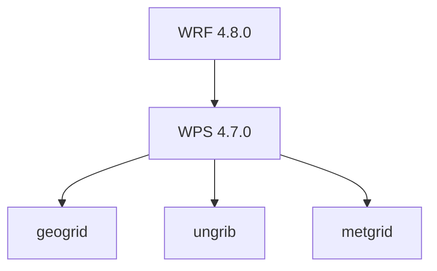

# wrfkit design notes

## Scope boundary

wrfkit separates three concerns:

1. **Software environment** — Nix pins compiler, MPI, NetCDF, CMake, WRF, and WPS.
2. **Scientific configuration** — YAML or native Fortran namelists.
3. **Execution backend** — local execution, Slurm, and site-specific MPI integration.

> Hide the system complexity, not the scientific configuration.

## Planned configuration modes

Case initialization will eventually ask:

```text
How would you like to configure WRF?

  1) YAML configuration
     Edit case.yaml.
     namelist.wps and namelist.input are generated automatically.

  2) Native WRF namelists
     Edit namelist.wps and namelist.input directly.

Select [1/2]:
```

YAML mode should expose WRF scientific options rather than replacing them with
opaque presets. A schema should define defaults, comments, allowed values, type
checks, validation, full-template generation, and native namelist generation.

Native mode treats `namelist.wps` and `namelist.input` as the source of truth.

## Storage model

wrfkit distinguishes storage by lifetime rather than by a particular HPC
filesystem layout.

**Persistent state** belongs with the project by default. This keeps the generic
workflow portable and avoids assuming that a machine provides `/scratch` or
`/lscratch`. The current default remains:

```text
<project>/.wrfkit/
```

Persistent state includes installed WRF/WPS artifacts, reusable downloaded data,
configuration/provenance, and other state that should survive normal temporary
workspace cleanup. Large reusable datasets may later support explicit path
overrides without changing this generic default.

**Disposable state** is high-I/O or reproducible temporary work that can be
recreated safely: build intermediates, staging areas, temporary links, and WPS
working files. A site profile may provide a `scratch_root` for this purpose.
Generic environments should prefer `$TMPDIR` when temporary storage is needed
rather than hard-coding `/tmp`.

The storage split is therefore conceptual:



A site-specific scratch path must not leak into scientific case configuration.

## Case, workspace, and log model

Tracked `cases/<name>` directories are configuration sources, not execution
directories. Native WPS/WRF programs run from a generated workspace:

```text
<project>/.wrfkit/work/<case>/
```

The workspace contains symlinks to case-owned namelists, pinned WPS/WRF runtime
tables, reusable forcing/geography, and generated WPS/WRF products. This keeps
Git status focused on intentional case-configuration changes while preserving
WRF's native file-based pipeline in one directory.

Execution logs are persistent provenance rather than disposable scratch data.
wrfkit therefore snapshots native WPS/WRF diagnostic logs under:

```text
<project>/.wrfkit/logs/<case>/<run-id>/
```

A run directory records the invoked command, working directory, exit status,
Slurm job/step identifiers when available, a run-start marker, and one
`native-logs.tar` archive. WPS logs (`geogrid.log*`, `metgrid.log*`,
`ungrib.log`) and WRF RSL logs (`rsl.out.*`, `rsl.error.*`) remain in the
execution workspace and are archived only when modified by the current run.
This deliberately avoids many per-file rename operations on shared filesystems,
where metadata latency can dominate a short model run. Model products remain in
the generated workspace; scientific configuration remains under
`cases/<name>`.

Until `wrfctl init` establishes a first-class case manifest, `wrfctl exec`
accepts `--case NAME`, resolves configuration from `cases/NAME`, stages
`.wrfkit/work/NAME`, and executes from that workspace. Users can launch case
commands from the repository root while WPS/WRF still see their native relative
filenames. The selected case name is also exported as `WRFKIT_CASE_NAME` so
execution logs are routed to `.wrfkit/logs/NAME`.

Without `--case`, case identity continues to fall back to `WRFKIT_CASE_NAME`,
a `cases/<name>/...` current path, or the current working directory.
Repository-root executions without a selected case use the transitional name
`default`.

## WPS build policy

wrfkit pins WPS 4.7.0 to release commit
`5feccecd63384381b6942371c7a837f66e4ccb84`. The WPS source is provided as a
non-flake Nix input and copied into project-local state before building.

The CMake workflow is used for both WRF and WPS. WPS is built only after a
CMake-built WRF installation exists, with:



The initial WPS build enables MPI for geogrid/metgrid and enables GRIB2 by
building the zlib/libpng/Jasper sources bundled with the pinned WPS release.
This avoids coupling the build to whatever Jasper ABI a generic host happens to
provide.

Build integration is separate from the future real-data workflow. The first
real-data milestone starts with a geogrid-only `athens-smoke` case. Its
low-resolution mandatory WPS geography is downloaded into persistent state at
`.wrfkit/data/geog/low-res-mandatory`; the source archive is cached separately
under `.wrfkit/cache`. This low-resolution dataset is a validation fixture, not
a production-data default.

The smoke case keeps its native `namelist.wps` tracked under
`cases/athens-smoke` and selects the `lowres` resolution defined by WPS
4.7.0's `GEOGRID.TBL.ARW`.

The first forcing path is GFS 0.25-degree data from NOAA/NCEP NOMADS. Case-level
forcing metadata is tracked in `forcing.conf`. `wrfctl fetch gfs --case NAME`
stores reusable GRIB2 files under persistent `.wrfkit/data/gfs`, while
`wrfctl prepare gfs --case NAME` creates `Vtable` and `GRIBFILE.???`
symlinks under `.wrfkit/work/NAME` without duplicating the forcing data. The initial
Athens smoke case deliberately uses a fixed short NOMADS window; because NOMADS
is a rolling operational service, a durable archived forcing backend remains a
future reproducibility improvement.

## MPI policy

The initial WRF build enables MPI and uses Nix-provided OpenMPI. WPS
`geogrid`/`metgrid` are also built with MPI. Single-node MPI remains the first
validated execution target.

WRF/WPS source error semantics are not modified to protect a Slurm shell or
batch job. Instead, execution isolation belongs to the scheduler backend.
Single-node Slurm execution uses one bridge topology:


An interactive shell that already occupies an `srun` step adds `--overlap`
to the child step. A normal single-node `sbatch` allocation uses the same
topology without `--overlap`.

The child step uses `--overlap` so it can coexist with the step hosting the
interactive shell. Before creating it, wrfkit removes inherited
`SLURM_CPU_BIND*` variables: those bindings describe the parent step and can
refer to CPUs outside a smaller child allocation. Slurm then computes a fresh
binding/cpuset for the one child task.

A Slurm child step may be created outside the rootless-Nix mount namespace of
its parent. The child therefore re-enters wrfkit's Nix environment once. The
pinned OpenMPI `mpirun` then creates all N ranks inside that same namespace,
avoiding concurrent Nix evaluations and cross-namespace same-node MPI
transports. The child Slurm step still owns exactly N CPUs.

Because the bridge intentionally creates one Slurm task with N CPUs, the inner
OpenMPI process would otherwise see a one-slot Slurm allocation. Immediately
before `mpirun`, wrfkit hides the child step's Slurm resource-manager variables.
The kernel/Slurm cpuset remains in force, while OpenMPI discovers and binds
ranks within those allowed CPUs.

MPI execution remains launcher-based. The first-class launcher values are
`auto`, `srun`, `mpirun`, `mpiexec`, and `custom`. With `auto`, an
active Slurm allocation selects the Slurm backend; otherwise wrfkit uses the
OpenMPI `mpirun` provided by the pinned Nix environment.

The machine profile may set `mpi_tasks=N` for fixed non-Slurm servers or
`mpi_tasks=auto`. For Slurm batch jobs, auto uses `SLURM_NTASKS`. For an
interactive `srun` shell that reserves one task with multiple CPUs, auto may
use `SLURM_CPUS_PER_TASK`. In either single-node case, the bridge reserves N
CPUs before starting N MPI ranks. `--ntasks N` and `--launcher NAME` are
per-run overrides. Interactive and batch single-node Slurm execution are both validated.
Multi-node rootless-Nix execution remains a separate validation target.

This is still a single-node-first policy. Multi-node support must additionally
validate node topology, task placement, rootless-Nix visibility, PMIx/UCX, and
site-specific fabric configuration without changing WRF/WPS source code.

The default Sapelo2 rootless-Nix store under `/lscratch` is node-local and
therefore cannot be assumed to exist on additional nodes. Multi-node execution
must use a shared store such as the `sapelo2-shared` profile, or realize an
equivalent environment independently on every participating node.

Generic multi-node MPI portability is not considered solved merely because WRF
compiles with MPI. HPC execution can depend on Slurm, PMIx, UCX, InfiniBand/RDMA,
and site-specific MPI configuration.

## Sapelo2 storage

The default Sapelo2 profile uses a disposable node-local Nix store:

```text
/lscratch/$USER/.nix
```

and declares the site scratch workspace:

```text
scratch_root=/lscratch/$USER/wrfkit
```

The scratch root is for disposable high-I/O work. Persistent wrfkit state remains
project-local by default; wrfkit does not require the repository itself to live
on any particular Sapelo2 filesystem. Case workspaces currently remain
project-local because they contain scientific products that must survive across
job/node boundaries. A future scratch-backed workspace policy must first define
explicit persistence for outputs such as `wrfout*`; `scratch_root` is therefore
not used implicitly for case execution yet.

The optional shared rootless-Nix profile uses:

```text
/scratch/$USER/.nix
```

The node-local `/lscratch` paths must not be the basis for generic multi-node
MPI assumptions.

## Milestones

- **0.1** WRF 4.8.0, GNU, NetCDF, OpenMPI build, ordinary Linux + Sapelo2 validation.
- **0.2** WPS 4.7.0 build integration and first real-data smoke case.
- **0.3** `wrfctl init`, native namelist workflow, provenance manifest.
- **0.4** YAML schema, annotated template, YAML -> namelist generation/validation.
- **0.5+** Slurm backend, site profiles, multi-node MPI, forcing-data acquisition.


## WRF real-data staging

Real-data WRF execution remains explicit: `metgrid -> real -> wrf`.
`wrfctl prepare wrf --case NAME` stages runtime tables and physics data by
symlinking files from the pinned WRF source tree's `run/` directory into
`.wrfkit/work/NAME`. The scientific `namelist.input` remains case-owned and
is exposed to the workspace through a generated symlink. This separates runtime
assets from scientific configuration while preserving WRF's native file layout
expectations.
