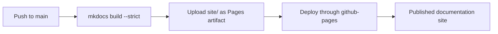

# Documentation site

The documentation is built with **Material for MkDocs** and deployed to GitHub
Pages by GitHub Actions.

Published URL:

```text
https://yonghuni.github.io/wrfkit/
```

## Why this layout?

The site separates beginner tutorials, task-oriented workflow guides,
configuration/reference material, and deeper explanation. A new user can
therefore finish a first run without reading implementation details first.

The pages should not behave like isolated chapters. Each practical guide should
link sideways to the layer it depends on and forward to the next likely task.
The intended knowledge graph is roughly:

```text
bootstrap / shell
      ↓
first run
      ↓
research case ↔ case.toml
      ↕
high-level ↔ low-level workflow
      ↕
troubleshooting / validation

flake.nix ↔ software environment / architecture
```

When adding a page, add it to navigation **and** add contextual links from the
pages where a user would naturally need it. Navigation alone is not enough.

## Preview locally

Create a Python environment however you normally do, then:

```bash
pip install -r requirements-docs.txt
mkdocs serve
```

Open:

```text
http://127.0.0.1:8000/
```

## Build exactly as CI does

```bash
pip install -r requirements-docs.txt
mkdocs build --strict
```

The generated site appears under `site/`.

## Deployment

The workflow is:

```text
.github/workflows/docs.yml
```

A documentation/configuration push to `main` follows this deployment path:



If Pages has never been enabled for the repository, an administrator must make
the one-time choice in **Settings -> Pages** to use **GitHub Actions** as the
publishing source.

## Documentation review checklist

Before merging a substantial documentation change:

1. run `mkdocs build --strict`;
2. confirm every new page is reachable from navigation;
3. confirm important concepts are cross-linked from adjacent tasks;
4. check commands against the current implementation rather than copying old
   examples;
5. render the deployed Pages site and inspect the home page, navigation, code
   blocks, tables, admonitions, and mobile-width behavior.
