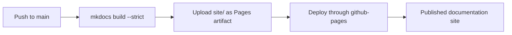

# Documentation site

The documentation is built with **Material for MkDocs** and deployed to GitHub
Pages by GitHub Actions.

Published URL:

```text
https://yonghuni.github.io/wrfkit/
```

## Why this layout?

The site separates beginner tutorials, task-oriented guides, reference
information, and deeper explanation. A new user can therefore finish a first
run without reading implementation details first.

## Preview locally

Create a Python environment however you normally do, then:

```bash
pip install -r requirements-docs.txt
mkdocs serve
```

Open:

```text
http://127.0.0.1:8000/
```

## Build exactly as CI does

```bash
pip install -r requirements-docs.txt
mkdocs build --strict
```

The generated site appears under `site/`.

## Deployment

The workflow is:

```text
.github/workflows/docs.yml
```

A documentation/configuration push to `main` follows this deployment path:



If Pages has never been enabled for the repository, an administrator must make
the one-time choice in **Settings -> Pages** to use **GitHub Actions** as the
publishing source.
