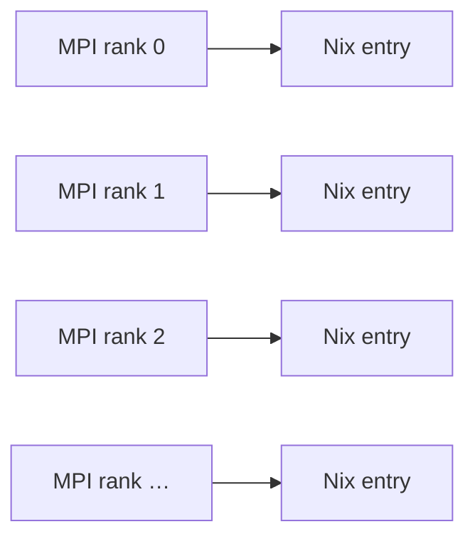
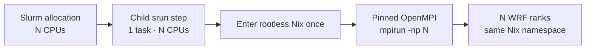

# How wrfkit works

You can use wrfkit without understanding this page. Read it when you want to
know what the wrapper is doing for you.

## Three separate layers

```text
1. Software environment
   Nix pins compiler + MPI + NetCDF + WRF + WPS

2. Scientific configuration
   cases/<case>/namelist.wps
   cases/<case>/namelist.input
   cases/<case>/forcing.conf

3. Execution backend
   local shell or Slurm single-node execution
```

Keeping these layers separate is the main design idea.

## Why Nix?

WRF depends on a collection of compilers and libraries. On different computers,
those versions can differ.

Nix gives wrfkit a controlled software environment so a run does not silently
switch to whatever compiler, MPI, or NetCDF happens to be installed on the host.

On HPC systems where users do not have root permission, wrfkit can use rootless
Nix.

## Why does Slurm launch only one child task first?

A naive rootless design can make every MPI rank enter Nix separately:



During development on Sapelo2 this led to repeated Nix evaluation, SQLite cache
contention, and UCX namespace errors.

The validated single-node design is instead:



Interactive allocations use the same basic bridge with the Slurm overlap option
needed by an already-running interactive step.

## Why separate case and workspace?

WRF/WPS naturally generate many files. If all of them lived beside the files you
edit, Git status and experiment provenance would become noisy.

So wrfkit treats:

```text
cases/<case>/          intentional scientific configuration
.wrfkit/work/<case>/   generated native execution workspace
```

as separate concepts.

## Why archive logs into one tar file?

WRF can create one pair of RSL files per MPI rank. Renaming many small files on
some shared HPC filesystems can be unexpectedly expensive.

wrfkit keeps native logs in the workspace and creates one per-run
`native-logs.tar` for persistent provenance.

For implementation details and future plans, see [Design notes](../design.md).
