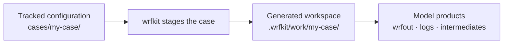

# Make a research case

A **case** is the tracked scientific configuration for one WRF experiment.

The bundled `athens-smoke` case is useful as a file-layout example, but it is
not a research recommendation.

## 1. Copy the smoke case as a starting point

```bash
cp -a cases/athens-smoke cases/my-case
```

Now you have:

```text
cases/my-case/
├── README.md
├── forcing.conf
├── namelist.input
└── namelist.wps
```

These tracked files are the part you intentionally edit and commit.

## 2. Decide the science before the compute settings

At minimum, review:

- study area and map projection;
- horizontal grid spacing and domain size;
- vertical levels;
- simulation start/end time;
- forcing dataset and boundary interval;
- physics parameterizations;
- time step;
- spin-up period;
- output interval;
- static geography resolution.

!!! danger "Changing only the date is not enough"
    A WRF run can finish successfully and still be a poor scientific
    experiment. `SUCCESS COMPLETE WRF` means the program completed; it does
    not validate your research design.

## 3. Keep configuration separate from generated files



Edit:

```text
cases/my-case/
```

Expect generated products under:

```text
.wrfkit/work/my-case/
```

Do not copy generated `wrfout`, `met_em`, or RSL files back into the tracked
case directory.

## 4. Run the workflow for the new case

The command shape stays the same:

```bash
./wrfctl exec geogrid --case my-case

./wrfctl fetch gfs --case my-case
./wrfctl prepare gfs --case my-case
./wrfctl exec ungrib --case my-case
./wrfctl exec metgrid --case my-case

./wrfctl prepare wrf --case my-case
./wrfctl exec real --case my-case
./wrfctl exec wrf --case my-case
```

The exact contents of `forcing.conf`, `namelist.wps`, and
`namelist.input` must match your experiment.

## 5. Do a short representative test first

Before requesting a long production run, measure:

- whether `real` and `wrf` complete;
- wall time;
- memory use;
- output size;
- expected variables and timestamps;
- whether fields look physically reasonable.

Then scale the simulation length or domain.

## What wrfkit does not choose for you

wrfkit deliberately does **not** decide what resolution, microphysics, PBL
scheme, cumulus treatment, radiation scheme, spin-up, or validation method is
best for your research question.

That scientific configuration should remain visible and reviewable in the
native WRF/WPS files.
