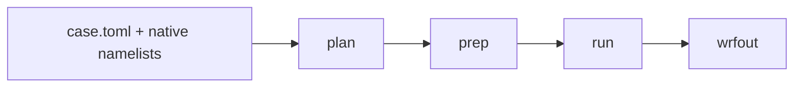

# wrfkit

**Run WRF without first becoming an expert in compilers, MPI, NetCDF, Nix, or Slurm.**

wrfkit gives the Weather Research and Forecasting (**WRF**) model a repeatable
software environment and a layered workflow while keeping the scientific
configuration visible.

[Start your first WRF run](tutorials/first-run.md){ .md-button .md-button--primary }
[Understand the configuration layers](explanation/how-it-works.md){ .md-button }

## The mental model

wrfkit separates four things that are easy to mix together in a hand-built WRF
installation:

```text
Machine / site policy
bootstrap.conf
      ↓
Reproducible software environment
flake.nix + wrfctl shell
      ↓
Scientific experiment
case.toml + native namelists
      ↓
Execution
plan → prep → run
```

That separation is deliberate:

- **bootstrap** describes the machine or HPC site;
- **flake.nix** describes the project software environment;
- **case.toml** describes common experiment-facing settings;
- **namelist.wps / namelist.input** remain the complete native WPS/WRF files;
- **wrfctl** orchestrates the supported execution path.

If you want the full explanation, read
[How wrfkit works](explanation/how-it-works.md).

## Recommended interactive workflow

Prepare the machine, then enter the pinned shell:

```bash
./bootstrap
./wrfctl shell
```

Inside the `(wrfkit)` shell:

```bash
wrfctl plan --case athens-minimal
wrfctl prep --case athens-minimal
wrfctl run  --case athens-minimal
```

- **plan** is read-only and shows the resolved experiment and execution plan.
- **prep** performs the WPS/input chain through `real.exe`.
- **run** checks preparation freshness, launches `wrf.exe`, and verifies
  current output.

Batch scripts do not need an interactive shell; they can call `./wrfctl`
directly.

[Bootstrap and enter the wrfkit shell](tutorials/bootstrap-and-shell.md)

## High-level or stage-by-stage

The short workflow is intentionally not the only interface.



When you need to inspect one native stage, the high-level path can be expanded
into:

```text
config
  ↓
fetch geography → geogrid
  ↓
fetch/stage forcing → ungrib
  ↓
metgrid
  ↓
stage WRF runtime → real.exe
  ↓
wrf.exe
```

The individual `fetch`, `prepare`, and `exec` commands remain available
for teaching and debugging.

[See the exact high-level ↔ low-level mapping](how-to/low-level-workflow.md)

## Configuration without hiding WRF

The convenience layer is intentionally smaller than the full WRF/WPS namelist
surface.

For common settings:

```toml
[domain]
dx = 3000
dy = 3000

[physics]
suite = "CONUS"
```

For a native option from the upstream manual:

```toml
[advanced.wrf.physics]
cu_physics = [0]
radt = [3]
```

You do not need to wait for wrfkit to add a convenience field for every valid
WRF/WPS namelist key. Native passthrough tables are open-ended, while unknown
wrfkit convenience sections/fields are rejected so typos do not silently
disappear.

[Read the detailed TOML and native namelist guide](reference/case-toml.md)

## Documentation map

The pages are intentionally cross-linked. Start with the question you actually
have:

| I want to... | Start here | Then see |
| --- | --- | --- |
| set up a machine or HPC environment | [Bootstrap and wrfkit shell](tutorials/bootstrap-and-shell.md) | [UGA Sapelo2](single-node-guide.md) |
| run WRF for the first time | [Your first WRF run](tutorials/first-run.md) | [Troubleshooting](troubleshooting.md) |
| make a research experiment | [Make a research case](how-to/research-case.md) | [Understand case.toml](reference/case-toml.md) |
| use a WRF/WPS option from the manual | [Understand case.toml](reference/case-toml.md) | [wrfctl commands](reference/commands.md) |
| rerun or debug one native stage | [High-level and low-level workflows](how-to/low-level-workflow.md) | [Troubleshooting](troubleshooting.md) |
| change Python/compiler/library packages | [Customize flake.nix](how-to/customize-flake.md) | [How wrfkit works](explanation/how-it-works.md) |
| submit on Sapelo2 | [UGA Sapelo2](single-node-guide.md) | [Run WRF with sbatch](how-to/sapelo2-batch.md) |
| verify what is actually supported | [Supported and validated](validation.md) | [Validation notes](development/validation-notes.md) |

## What wrfkit handles, and what you still control

wrfkit handles the **software/workflow layer**: the pinned compiler, MPI,
NetCDF, WRF/WPS sources, build path, supported launch logic, input staging,
logging, and high-level safety checks.

You still control the **science**: simulation dates, model domain, resolution,
forcing choices, physics, time step, output frequency, and any additional
native WRF/WPS namelist settings.

A successful run proves that the software path completed. It does not prove
that a scientific experiment is appropriate.

## Current support boundary

The strongest tested path is currently:

```text
Linux x86_64
+ WRF 4.8.0 / WPS 4.7.0
+ normal or rootless Nix
+ GFS real-data preparation
+ managed or external WPS geography
+ one compute node
+ local or single-node Slurm MPI
```

The current 3 km `athens-highres` case has completed end to end on UGA
Sapelo2. Its 3 km Lambda Vector end-to-end regression remains pending because
the observed automatic standalone rank request exceeded available PRRTE launch
slots.

Multi-node MPI, WRF restart/recovery, WRF-Chem, and WRFDA are not yet claimed
as validated workflows.

The [validation page](validation.md) is the source of truth for this boundary.
