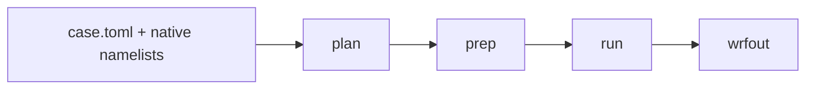

# wrfkit

**Run WRF without first becoming an expert in compilers, MPI, NetCDF, Nix, or Slurm.**

wrfkit gives the Weather Research and Forecasting (**WRF**) model a repeatable
software environment and a simple workflow. It is designed for people who want
to learn or use WRF while keeping the real scientific settings visible.

[Start your first WRF run](tutorials/first-run.md){ .md-button .md-button--primary }

!!! note "New to WRF or HPC?"
    That is fine. The first-run tutorial explains each step and tells you what
    result to look for. When an unfamiliar word appears, use the
    [glossary](reference/glossary.md).

## The basic workflow

For a prepared example case, the main workflow is only three commands:

```bash
./wrfctl plan --case athens-minimal
./wrfctl prep --case athens-minimal
./wrfctl run  --case athens-minimal
```

- **plan** shows what wrfkit intends to do. It does not change files.
- **prep** prepares geography and weather input, then creates WRF initial and
  boundary files.
- **run** starts WRF and checks that the run really produced a new output file.



## What wrfkit handles, and what you still control

wrfkit handles the **computer setup and workflow**: the compiler, MPI, NetCDF,
WRF/WPS versions, build steps, and supported single-node execution path.

You still control the **science**: the simulation dates, model domain,
resolution, physics choices, time step, output frequency, and the native
`namelist.wps` / `namelist.input` files.

A `case.toml` file gives you a shorter way to set many common options. It can
also pass lower-level WRF/WPS namelist settings when you need more control.

[Learn what every case.toml section means](reference/case-toml.md)

## Where should I go next?

| I want to... | Read this |
| --- | --- |
| run WRF for the first time | [Your first WRF run](tutorials/first-run.md) |
| use UGA Sapelo2 | [UGA Sapelo2](single-node-guide.md) |
| make my own experiment | [Make a research case](how-to/research-case.md) |
| understand or edit `case.toml` | [Understand case.toml](reference/case-toml.md) |
| find a command quickly | [wrfctl command reference](reference/commands.md) |
| fix an error | [Troubleshooting](troubleshooting.md) |
| check what is actually supported | [Supported and validated](validation.md) |

## Current support boundary

The strongest tested path is currently:

```text
Linux x86_64
+ WRF 4.8.0 / WPS 4.7.0
+ normal or rootless Nix
+ GFS real-data preparation
+ one compute node
+ local or single-node Slurm MPI
```

Multi-node MPI, WRF restart/recovery, WRF-Chem, and WRFDA are not yet claimed
as supported. The high-resolution mandatory geography downloader is implemented,
but a live official-archive end-to-end validation is still pending.

The [validation page](validation.md) is the source of truth for this boundary.
