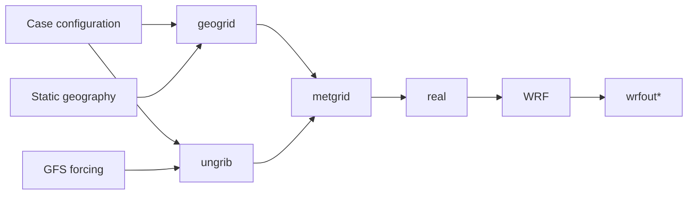

# Single-node research guide

This guide is the supported path for running WRF with wrfkit on one compute
node. The Sapelo2 examples use Slurm, but the same case/workspace model applies
to a fixed Linux workstation or server.

**Validated path**



> [!IMPORTANT]
> wrfkit validates the software environment and execution workflow. It does not
> decide whether a domain, physics suite, spin-up period, forcing dataset, or
> output interval is scientifically appropriate for a particular study.

## 1. Clone and inspect

```bash
git clone git@github.com:YONGHUNI/wrfkit.git
cd wrfkit

./wrfctl --help
```

If Nix is already available, you can proceed directly to `wrfctl`. On a
machine without Nix, use `./bootstrap`.

## 2. Sapelo2: obtain a compute allocation for setup

Do not build WRF/WPS on an `ss-sub*` login node.

```bash
interact -c 16 --mem=64G --time=02:00:00 --gres=lscratch:100

cd ~/work/project/wrfkit
./bootstrap --profile sapelo2
./wrfctl doctor
./wrfctl build all
```

The default Sapelo2 profile keeps the rootless Nix store under
`/lscratch/$USER/.nix`. A node that already has a working managed Nix
environment will simply report that bootstrap is not needed and continue.

## 3. Validate the installation with the bundled case

The repository includes `cases/athens-smoke`, a deliberately small
single-domain case for workflow validation.

Inspect the resolved science and planned stages without changing files:

```bash
./wrfctl plan --case athens-smoke
```

Prepare the entire case through `real.exe`, then run WRF:

```bash
./wrfctl prep --case athens-smoke
./wrfctl run  --case athens-smoke
```

For debugging or teaching, the individual
`fetch -> geogrid -> ungrib -> metgrid -> real -> wrf` commands remain
available through the low-level interface.

A successful run should leave `wrfout_d01_*` under
`.wrfkit/work/athens-smoke/`.

## 4. Understand the case/workspace split

Tracked scientific configuration lives under:

```text
cases/<case>/
├── case.toml
├── namelist.wps
└── namelist.input
```

Generated execution state lives under:

```text
.wrfkit/work/<case>/
```

Typical generated products include:

```text
geo_em.*
FILE:*
met_em.*
wrfinput_d01
wrfbdy_d01
wrfout_d01_*
rsl.out.*
rsl.error.*
```

This separation keeps Git focused on intentional scientific configuration while
allowing WPS and WRF to use their normal file-based workflow.

## 5. Run a prepared case with sbatch

The repository includes a copy-pasteable example:

```text
examples/sapelo2-single-node.sbatch
```

Submit the bundled smoke case:

```bash
sbatch examples/sapelo2-single-node.sbatch
```

Submit a different prepared case:

```bash
WRFKIT_CASE=my-case sbatch examples/sapelo2-single-node.sbatch
```

The example requests one node and 16 tasks. In a single-node Slurm allocation,
wrfkit converts that allocation into one child Slurm task with 16 CPUs, enters
the rootless-Nix namespace once, and launches the 16 WRF ranks with the pinned
OpenMPI `mpirun`.

Do not wrap `wrfctl exec wrf` in another `srun -n 16`; wrfkit owns that
single-node launch topology.

## 6. Check success and provenance

Scientific products remain in:

```text
.wrfkit/work/<case>/
```

Per-run provenance is stored in:

```text
.wrfkit/logs/<case>/<run-id>/
├── command.txt
├── run.env
├── run.started
└── native-logs.tar
```

For the most recent WRF run of the smoke case:

```bash
LOG=$(find .wrfkit/logs/athens-smoke \
  -maxdepth 1 -type d -name '*_wrf' | sort | tail -1)

tar -xOf "$LOG/native-logs.tar" rsl.out.0000 |
  grep "SUCCESS COMPLETE WRF"
```

Expected result:

```text
wrf: SUCCESS COMPLETE WRF
```

## 7. Create a research case

A practical starting point is to copy the smoke case configuration and then
replace the scientific settings deliberately:

```bash
cp -a cases/athens-smoke cases/my-case
```

At minimum, review the domain/projection, horizontal and vertical resolution,
simulation dates, forcing configuration, physics choices, time step, spin-up,
boundary interval, and output frequency.

> [!WARNING]
> Copying `athens-smoke` and changing only the dates does not make the result
> research-quality. The included low-resolution geography and compact 12 km
> configuration are validation fixtures.

## 8. Before a long production run

Run a representative short experiment first. Record wall time, memory use,
output volume, and the exact case configuration. For a new scientific setup,
also verify expected physical fields and model behavior rather than relying only
on `SUCCESS COMPLETE WRF`.

Current multi-node execution is not claimed as validated. If the experiment no
longer fits on one node, consult [validation.md](validation.md) before scaling
out.
