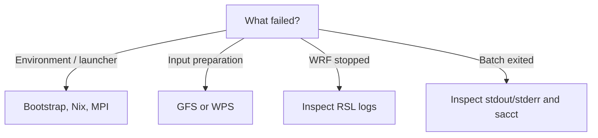

# Troubleshooting

Start here before reading hundreds of log lines.

If the failure is clearly tied to one layer, jump to the corresponding guide:

- environment/Nix/MPI: [Bootstrap and enter the wrfkit shell](tutorials/bootstrap-and-shell.md);
- case parsing or namelist mapping: [Understand case.toml](reference/case-toml.md);
- one WPS/WRF stage: [High-level and low-level workflows](how-to/low-level-workflow.md);
- Sapelo2 allocation/storage: [UGA Sapelo2](single-node-guide.md).



## `mpirun: command not found`

If you typed `mpirun` directly in the normal host/login shell, this can be
expected. wrfkit's pinned OpenMPI lives inside its Nix environment.

For interactive work, enter the project environment first:

```bash
./wrfctl shell
```

Then use the high-level workflow:

```bash
wrfctl run --case my-case
```

or, when you deliberately need the native stage:

```bash
wrfctl exec wrf --case my-case
```

Do not manually call the inner `mpirun` for the standard workflow.

## `Sapelo2 login node detected`

You are trying to bootstrap/build on an `ss-sub*` login node.

For interactive work:

```bash
interact -c 16 --mem=64G --time=02:00:00 --gres=lscratch:100
```

Then run bootstrap/build from the compute node.

For batch work, submit `sbatch` from the login node and let Slurm run the
script on a compute node.

## `a working nix installation is already available`

This is informational, not a failure. Continue with the next command.

## `met_em.*` does not exist

The WPS pipeline is incomplete. In the interactive wrfkit shell, the native
sequence is:

```bash
wrfctl fetch geog --case my-case
wrfctl exec geogrid --case my-case
wrfctl fetch gfs --case my-case
wrfctl prepare gfs --case my-case
wrfctl exec ungrib --case my-case
wrfctl exec metgrid --case my-case
```

For normal use, `wrfctl prep --case my-case` orchestrates this sequence and
adds final input verification plus a preparation manifest.

## WRF did not print `SUCCESS COMPLETE WRF`

Find the latest WRF archive:

```bash
CASE=my-case
LOG=$(find ".wrfkit/logs/$CASE" \
  -maxdepth 1 -type d -name '*_wrf' | sort | tail -1)
```

Read rank 0 error output:

```bash
tar -xOf "$LOG/native-logs.tar" rsl.error.0000 | tail -80
```

Also check `rsl.out.0000`.

## Many `waiting for another Nix process`, SQLite busy errors, or UCX permission errors

The current validated single-node bridge was designed to remove the earlier
one-Nix-entry-per-MPI-rank topology that produced these symptoms.

Check that:

```bash
git pull
git log -1 --oneline
```

shows a current wrfkit revision, and make sure you are **not** doing this:

```bash
srun -n 16 ./wrfctl exec wrf --case my-case
```

Use wrfkit's own launcher path instead.

## GFS download fails

The bundled minimal case uses a fixed GFS window from an operational rolling
NOMADS service. That is convenient for validation but not a permanent archive.

A failure may therefore be a data-availability problem rather than a compiler or
MPI problem. Check the case forcing settings and data source before debugging
WRF itself.

## Batch job failed instantly

Check both files:

```bash
tail -80 wrfkit-JOBID.out
tail -80 wrfkit-JOBID.err
```

Then inspect Slurm:

```bash
sacct -j JOBID --format=JobID,State,ExitCode,Elapsed,NodeList,AllocCPUS
```

## Still stuck?

Collect these four things before opening an issue:

```text
1. git log -1 --oneline
2. ./wrfctl doctor output
3. relevant Slurm job ID + sacct result
4. latest native-logs.tar error excerpt
```

That usually separates environment, scheduler, WPS, and WRF failures quickly.

## Related pages

- [Bootstrap and enter the wrfkit shell](tutorials/bootstrap-and-shell.md)
- [Understand case.toml](reference/case-toml.md)
- [High-level and low-level workflows](how-to/low-level-workflow.md)
- [Check whether a run succeeded](how-to/check-run.md)
- [Supported and validated](validation.md)
