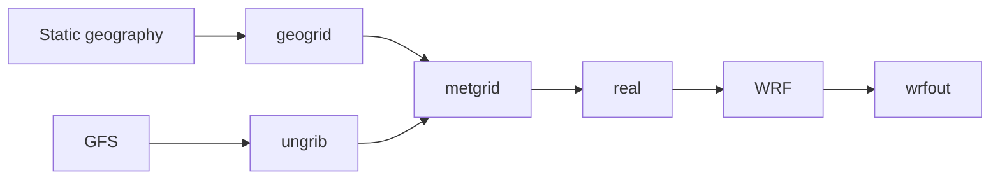

# Your first WRF run

This tutorial takes you from a fresh copy of wrfkit to one completed WRF
simulation.

You do **not** need to understand WRF, MPI, Slurm, or Nix before starting.
The included `athens-smoke` case is deliberately small and exists to test the
workflow.

**Goal:** finish with this message:

```text
wrf: SUCCESS COMPLETE WRF
```

!!! warning "The smoke case is not a research setup"
    A program can run successfully even when its scientific settings are not
    appropriate for a real study. Use this tutorial to learn the workflow.
    Later, use [Make a research case](../how-to/research-case.md) to design an
    experiment deliberately.

## Before you start

You need:

- a Linux x86_64 computer;
- Git;
- enough storage for WRF/WPS builds, input data, and output;
- on an HPC cluster, permission to request a compute allocation.

If you are using **UGA Sapelo2**, read the short
[Sapelo2 guide](../single-node-guide.md) as well. In particular, do not compile
WRF or run the model on an `ss-sub*` login node.

## Step 1 — get wrfkit

Choose a suitable working directory, then clone the repository:

```bash
git clone https://github.com/YONGHUNI/wrfkit.git
cd wrfkit
```

If you already have the repository:

```bash
cd /path/to/wrfkit
git pull
```

**Checkpoint:**

```bash
ls
```

You should see files such as `wrfctl`, `bootstrap`, `flake.nix`, and
`cases/`.

## Step 2 — if you are on an HPC cluster, get a compute node

=== "Standalone Linux"

    Stay in the repository and continue to Step 3.

=== "UGA Sapelo2"

    From a login node, request an interactive compute allocation:

    ```bash
    interact -c 16 --mem=64G --time=02:00:00 --gres=lscratch:100
    ```

    When the prompt changes to a compute node, return to the wrfkit repository.

    !!! important
        The login node is for lightweight tasks such as editing files,
        checking jobs, and submitting jobs. Building WRF/WPS and running WRF
        belong on compute nodes.

## Step 3 — prepare the software environment

Run:

```bash
./bootstrap
```

wrfkit detects whether it is on a normal Linux machine or a Slurm HPC system
and asks a few short questions when a machine configuration has not been saved
yet.

=== "Standalone Linux"

    Choose **Standalone Linux workstation/server** when prompted.

=== "UGA Sapelo2"

    Choose **Slurm HPC cluster** and then **UGA Sapelo2**. Run bootstrap from
    the compute allocation obtained in Step 2.

If a working Nix installation is already available, bootstrap may say that no
installation is needed. That is normal.

**Checkpoint:** bootstrap should finish successfully rather than stop with an
error.

## Step 4 — check and build WRF/WPS

Check the managed environment:

```bash
./wrfctl doctor
```

The important compiler, MPI, NetCDF, WRF, and WPS checks should report
`[OK]`.

Now build WRF and WPS:

```bash
./wrfctl build all
```

The first build can take a while. Near the end of a successful build you should
see:

```text
WPS build completed.
```

!!! note
    Compiler warnings can appear during a successful build. The important
    question is whether the command reaches its completion message or stops
    with an error.

## Step 5 — look at the example before running it

The example configuration is here:

```text
cases/athens-smoke/
├── case.toml
├── namelist.wps
└── namelist.input
```

Ask wrfkit to show the resolved plan:

```bash
./wrfctl plan --case athens-smoke
```

`plan` is read-only. It shows the simulation period, forcing, domain, MPI
layout, and stages without changing the case.

If the TOML file is unfamiliar, see
[Understand case.toml](../reference/case-toml.md).

## Step 6 — prepare the model input

Run:

```bash
./wrfctl prep --case athens-smoke
```

This high-level command performs the preparation chain for the currently
supported smoke-test path:

```text
static geography
      ↓
geogrid
      ↓
GFS → ungrib
      ↓
metgrid
      ↓
real.exe
      ↓
wrfinput + wrfbdy
```

**Checkpoint:**

```bash
ls .wrfkit/work/athens-smoke/wrfinput_d01
ls .wrfkit/work/athens-smoke/wrfbdy_d01
```

Both files should exist.

## Step 7 — run WRF

Run:

```bash
./wrfctl run --case athens-smoke
```

On supported single-node Slurm systems, wrfkit manages the MPI launch. Do not
wrap this command in another multi-rank `srun`.

## Step 8 — check the result

First look for WRF output:

```bash
ls .wrfkit/work/athens-smoke/wrfout_d01_*
```

Then inspect the newest archived rank-0 log:

```bash
LOG=$(find .wrfkit/logs/athens-smoke   -maxdepth 1 -type d -name '*_wrf' | sort | tail -1)

tar -xOf "$LOG/native-logs.tar" rsl.out.0000 |
  grep "SUCCESS COMPLETE WRF"
```

Expected:

```text
wrf: SUCCESS COMPLETE WRF
```

If that line is missing, go to [Troubleshooting](../troubleshooting.md).

## What just happened?

The short user workflow was:

```text
plan → prep → run
```

Underneath, WRF still used its normal preparation programs:



wrfkit does not replace these programs. It organizes their software
environment, files, and supported execution path.

## Want to see each native stage?

For learning or debugging, you can run the lower-level steps individually:

```bash
./wrfctl fetch geog
./wrfctl exec geogrid --case athens-smoke

./wrfctl fetch gfs --case athens-smoke
./wrfctl prepare gfs --case athens-smoke
./wrfctl exec ungrib --case athens-smoke
./wrfctl exec metgrid --case athens-smoke

./wrfctl prepare wrf --case athens-smoke
./wrfctl exec real --case athens-smoke
./wrfctl exec wrf --case athens-smoke
```

For normal use, prefer the shorter `prep` + `run` path.

## Next step

To turn the smoke test into your own experiment, continue with
[Make a research case](../how-to/research-case.md). The next page explains
which scientific choices must be reconsidered instead of copied blindly.
