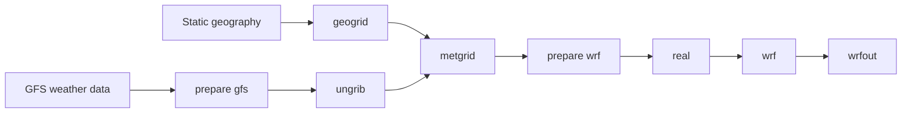

# Your first WRF run

This tutorial gets one tiny WRF simulation to finish successfully. You do not
need prior WRF, HPC, or Nix experience.

**Goal:** see this line at the end:

```text
wrf: SUCCESS COMPLETE WRF
```

The tutorial uses the included `athens-smoke` case. It is a **software test**,
not a research-quality weather experiment.

The workflow works on an ordinary Linux machine and on supported HPC systems.
When an HPC command is site-specific, this tutorial uses the University of
Georgia's **Sapelo2** Slurm cluster as a concrete example. The currently
validated Slurm path is single-node execution on Sapelo2; see the
[validation matrix](../validation.md) for the exact support boundary.

!!! tip "Follow the tab that matches your machine"
    Environment-specific steps are shown as **Standalone Linux** and
    **Slurm HPC** tabs. Once you select one, the documentation site keeps
    matching tabs synchronized as you move through the page.

## Before you start

You need:

- a Linux x86_64 machine;
- Git;
- enough disk space for WRF/WPS, input data, builds, and outputs;
- if using an HPC cluster, an account that can log in and request compute
  resources.

!!! tip "Choose a suitable filesystem before cloning"
    HPC clusters often provide several filesystems with different quotas,
    backup policies, purge rules, and intended uses. Check your site's storage
    documentation before deciding where to keep wrfkit.

    wrfkit currently keeps builds, reusable input data, execution workspaces,
    and model output under the repository's `.wrfkit/` directory by default.
    A filesystem intended only for small source files may therefore be a poor
    location for the complete workflow.

    **Sapelo2 example:** `/home/$USER` is suitable for relatively static files
    such as scripts and source code, while lab `/work` space is intended for
    files reused by jobs. `/scratch` and node-local `/lscratch` serve
    temporary workloads. Use a suitable lab/project work location when one is
    available rather than assuming your home directory is the best place for
    the whole workflow.

## Step 1 — get the code

Clone the public repository into the filesystem you chose above:

```bash
git clone https://github.com/YONGHUNI/wrfkit.git
cd wrfkit
```

If you already cloned the repository:

```bash
cd /path/to/wrfkit
git pull
```

**Checkpoint:** this should show files such as `wrfctl`, `bootstrap`,
`flake.nix`, and `cases/`:

```bash
ls
```

## Step 2 — prepare the machine for compute work

=== "Standalone Linux"

    If this is a workstation or server where you are allowed to run
    compute-intensive work directly, there is no scheduler allocation step.

    Stay in the wrfkit repository and continue to Step 3.

=== "Slurm HPC"

    On a shared HPC cluster, request an interactive compute allocation using
    your site's documented method before setting up or building the
    environment.

    !!! example "UGA Sapelo2"
        Sapelo2 provides the `interact` helper. For this smoke test:

        ```bash
        interact -c 16 --mem=64G --time=02:00:00 --gres=lscratch:100
        ```

        `--gres=lscratch:100` requests 100 GB of node-local temporary
        storage for the allocation. The Sapelo2 wrfkit profile places its
        rootless Nix store under `/lscratch/$USER`, so explicitly requesting
        local scratch is the appropriate pattern.

    !!! warning "Do not build on a shared login node"
        For a Slurm configuration with allocation protection enabled, wrfkit
        requires an active Slurm compute allocation before bootstrap
        setup/build work. This check uses Slurm allocation state rather than a
        site-specific hostname.

## Step 3 — prepare the wrfkit environment

**Under the hood:** wrfkit uses Nix to provide a reproducible compiler, MPI,
NetCDF, WRF, and WPS environment. You do not need to install or configure Nix
manually.

When neither `--profile` nor `--config` is supplied and no saved wrfkit
machine configuration exists, `./bootstrap` asks a few questions. It detects
a likely default, but **you make the final choice**.

=== "Standalone Linux"

    Run:

    ```bash
    ./bootstrap
    ```

    On a tested standalone Linux server without Slurm commands, wrfkit chose
    the standalone path as the default:

    ```text
    wrfkit machine setup

    Choose the environment that best describes this machine. If you are unsure,
    press Enter to accept the detected default.

      1) Standalone Linux workstation/server
      2) Slurm HPC cluster
    System type [1/2] (default: 1):
    ```

    Pressing **Enter** accepts the default. wrfkit then stores a machine
    configuration equivalent to:

    ```ini
    profile=generic
    backend=auto
    scheduler=none
    require_allocation=false
    mpi_launcher=auto
    mpi_tasks=1
    ```

    If a working Nix installation is already available, bootstrap may finish
    immediately with:

    ```text
    wrfkit: a working nix installation is already available; bootstrap is not needed.
    ```

    That is **not an error**. If Nix is missing, bootstrap installs the managed
    rootless environment automatically.

=== "Slurm HPC"

    Run this from the compute allocation obtained in Step 2:

    ```bash
    ./bootstrap
    ```

    On Sapelo2, a first run currently looks like this:

    ```text
    wrfkit machine setup

    Choose the environment that best describes this machine. If you are unsure,
    press Enter to accept the detected default.

      1) Standalone Linux workstation/server
      2) Slurm HPC cluster
    System type [1/2] (default: 2):

    Choose a site profile. The generic profile works for Slurm clusters that do not
    need Sapelo2-specific storage paths.

      1) Generic Slurm HPC
      2) UGA Sapelo2 (node-local /lscratch Nix store)
      3) UGA Sapelo2 shared-store profile (/scratch)
    Site profile [1/2/3] (default: 2):

    Active Slurm compute allocation detected.
    Requiring an allocation helps prevent setup/build work on shared login nodes.

    Require an active Slurm compute allocation for future bootstrap setup/build operations? [Y/n]
    ```

    For this Sapelo2 example, pressing **Enter** at all three prompts accepts
    the detected defaults.

    If you choose **Generic Slurm HPC** instead, the wizard also asks whether
    to use a custom rootless Nix store path. Different clusters use different
    scratch or node-local filesystem names, so wrfkit does not guess one. Use
    your site's documented writable path when appropriate, or keep the default.
    This setting changes the Nix store location only; case workspaces still
    remain under `.wrfkit/work/<case>`.

    Bootstrap then saves the machine configuration and shows the resolved
    policy:

    ```text
    Selected: Slurm HPC cluster (sapelo2)

    Saved machine configuration to:
      /home/<user>/.config/wrfkit/bootstrap.conf

    wrfkit bootstrap
      profile:      sapelo2
      scheduler:    slurm
      allocation:   true
      store root:   /lscratch/<user>/.nix
      scratch root: /lscratch/<user>/wrfkit
      backend:      auto
      MPI launcher: srun
      MPI tasks:    auto
    ```

    If rootless Nix needs to be installed, bootstrap performs that setup
    automatically. A successful run ends with:

    ```text
    wrfkit: rootless Nix bootstrap completed.

    Next:
      ./wrfctl doctor
      ./wrfctl build all
    ```

    !!! note "Some rootless-Nix warnings can be normal"
        On the validated Sapelo2 run, the upstream `nix-user-chroot` runtime
        probe fell back successfully to its compatibility mode, and the Nix
        build sandbox was unavailable. Bootstrap still completed
        successfully.

        The useful criterion is the final success message above, not the
        absence of every warning.

    !!! note "Why might the physical store path look different?"
        On the observed Sapelo2 node, `/lscratch/<user>/.nix` resolved to
        `/tmp/lscratch/<user>/.nix`. Both names referred to the same 121 MB
        store immediately after bootstrap. The rootless-Nix diagnostic
        therefore reported the resolved physical path rather than a second
        Nix store.

    If bootstrap installed rootless Nix, you can optionally inspect it with:

    ```bash
    rootless-nix-doctor
    ```

    A healthy Sapelo2 result includes checks such as:

    ```text
    [OK] nix command: /home/<user>/.local/bin/nix
    [OK] Nix evaluator works
    [OK] flake support works
    [OK] nix-user-chroot root method: chroot
    [OK] unprivileged user namespaces available
    [OK] NVIDIA host driver visible
    [OK] libcuda.so.1 bridge configured
    ```

The saved machine configuration is reused on later runs. To change it
intentionally:

```bash
./bootstrap --configure
```

## Step 4 — check and build the software

First check the pinned environment:

```bash
./wrfctl doctor
```

=== "Standalone Linux"

    A healthy standalone check should report the required toolchain and pinned
    sources as `[OK]`. For example:

    ```text
    wrfkit doctor

    WRF version: 4.8.0
    WPS version: 4.7.0

    [OK]   gcc -> /nix/store/.../bin/gcc
    [OK]   gfortran -> /nix/store/.../bin/gfortran
    [OK]   cmake -> /nix/store/.../bin/cmake
    [OK]   mpirun -> /nix/store/.../bin/mpirun
    [OK]   nc-config -> /nix/store/.../bin/nc-config
    [OK]   nf-config -> /nix/store/.../bin/nf-config
    [OK]   tcsh -> /nix/store/.../bin/tcsh

    Pinned WRF source
    [OK]   /nix/store/...-v4.8.0.tar.gz

    Pinned WPS source
    [OK]   /nix/store/...-source
    ```

=== "Slurm HPC"

    The same pinned compiler/MPI/NetCDF checks should pass. Inside an active
    Slurm allocation, doctor also checks `srun` and reports allocation
    information.

    The important checkpoint is that the required build tools and pinned
    WRF/WPS sources report `[OK]`.

Then build WRF and WPS:

```bash
./wrfctl build all
```

The first build can take time. wrfkit parallelizes the WRF build using the
available CPU count (or `--jobs N` when you set one), then builds WPS
serially. WPS 4.7.0 can race when multiple build targets write the same
Fortran module files in parallel, so wrfkit deliberately uses one WPS build
job for reliability.

wrfkit pins the compiler, MPI, NetCDF, WRF, and WPS environment so later runs
use the same software stack.

**Checkpoint:** after the build, the installed programs are under:

```text
.wrfkit/install/
├── wrf-4.8.0/bin/
└── wps-4.7.0/bin/
```

## Step 5 — prepare the map

Download the small geography dataset used by the smoke test:

```bash
./wrfctl fetch geog
```

Run `geogrid`:

```bash
./wrfctl exec geogrid --case athens-smoke
```

**Checkpoint:**

```bash
ls .wrfkit/work/athens-smoke/geo_em.d01.nc
```

If that file exists, the domain/static-geography stage worked.

## Step 6 — prepare weather input

Download the GFS files defined by the smoke case:

```bash
./wrfctl fetch gfs --case athens-smoke
```

Stage them for WPS:

```bash
./wrfctl prepare gfs --case athens-smoke
```

Convert the GRIB weather files:

```bash
./wrfctl exec ungrib --case athens-smoke
```

Put the weather fields onto the WRF grid:

```bash
./wrfctl exec metgrid --case athens-smoke
```

**Checkpoint:**

```bash
ls .wrfkit/work/athens-smoke/met_em.*
```

You should see `met_em` files for the smoke-test times.

!!! note "Why are there several commands?"
    WPS is a preparation pipeline. `geogrid` defines the model domain and
    prepares static geography, `ungrib` decodes the external weather data,
    and `metgrid` places those fields on the model grid.

## Step 7 — create WRF initial and boundary files

```bash
./wrfctl prepare wrf --case athens-smoke
./wrfctl exec real --case athens-smoke
```

**Checkpoint:**

```bash
ls .wrfkit/work/athens-smoke/wrfinput_d01
ls .wrfkit/work/athens-smoke/wrfbdy_d01
```

## Step 8 — run WRF

```bash
./wrfctl exec wrf --case athens-smoke
```

=== "Standalone Linux"

    The generic standalone profile uses the configured MPI launcher and task
    count. The first-run default is conservative: `mpi_launcher=auto` and
    `mpi_tasks=1`.

=== "Slurm HPC"

    Inside a supported single-node Slurm allocation, wrfkit owns the MPI
    launch path. Do **not** add another `srun -n ...` around the command.
    The current Slurm validation is on Sapelo2.

## Step 9 — check success

Find the newest WRF log archive:

```bash
LOG=$(find .wrfkit/logs/athens-smoke \
  -maxdepth 1 -type d -name '*_wrf' | sort | tail -1)
```

Check rank 0:

```bash
tar -xOf "$LOG/native-logs.tar" rsl.out.0000 |
  grep "SUCCESS COMPLETE WRF"
```

Expected:

```text
wrf: SUCCESS COMPLETE WRF
```

Then look for model output:

```bash
ls .wrfkit/work/athens-smoke/wrfout_d01_*
```

## You just used the full pipeline



Next, read [Make a research case](../how-to/research-case.md). It explains why
the smoke test should not simply be copied and treated as a scientific setup.
