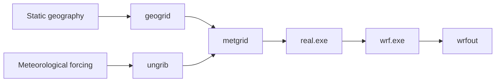

# Your first WRF run

This tutorial takes you from a fresh copy of wrfkit to one completed WRF
simulation.

You do **not** need to understand WRF, MPI, Slurm, or Nix before starting.
The included `athens-minimal` case is deliberately small and exists to test
the workflow.

**Goal:** finish with this message:

```text
wrf: SUCCESS COMPLETE WRF
```

!!! warning "The minimal case is not a research setup"
    A program can run successfully even when its scientific settings are not
    appropriate for a real study. Use this tutorial to learn the workflow.
    Later, use [Make a research case](../how-to/research-case.md) to design an
    experiment deliberately.

## Before you start

You need:

- a Linux x86_64 computer;
- Git;
- enough storage for WRF/WPS builds, input data, and output;
- on an HPC cluster, permission to request a compute allocation.

The interactive documentation uses one consistent model:

```text
bootstrap once for the machine
        ↓
enter wrfctl shell
        ↓
use wrfctl commands inside that environment
```

Read [Bootstrap and enter the wrfkit shell](bootstrap-and-shell.md) for the
full environment explanation.

UGA Sapelo2 users should also keep the
[Sapelo2 guide](../single-node-guide.md) open.

## Step 1 — get wrfkit

Choose a suitable working directory, then clone the repository:

```bash
git clone https://github.com/YONGHUNI/wrfkit.git
cd wrfkit
```

If you already have the repository:

```bash
cd /path/to/wrfkit
git pull
```

Checkpoint:

```bash
ls
```

You should see `wrfctl`, `bootstrap`, `flake.nix`, `cases/`, and
`docs/`.

## Step 2 — on HPC, get a compute node first

=== "Standalone Linux"

    Stay in the repository and continue.

=== "Generic Slurm HPC"

    From the login node, request one compute node using your site's normal
    policy. A generic example is:

    ```bash
    salloc --nodes=1 --ntasks=16 --mem=64G --time=02:00:00
    srun --pty bash
    ```

    Then return to the repository on the compute node.

    Your site may require `--partition`, `--account`, `--qos`, or a
    different interactive helper.

=== "UGA Sapelo2"

    Follow [UGA Sapelo2](../single-node-guide.md). Do not build or run WRF on
    an `ss-sub*` login node.

## Step 3 — bootstrap the machine

From the repository root:

```bash
./bootstrap
```

If this is a new machine/profile, bootstrap guides you through standalone or
Slurm settings and records machine policy in:

```text
~/.config/wrfkit/bootstrap.conf
```

If a working Nix setup already exists, bootstrap may say no installation is
needed. That is normal.

Do not put scientific case settings into the bootstrap configuration. Domain,
forcing, physics, and output choices belong in
[case.toml](../reference/case-toml.md).

## Step 4 — enter the wrfkit shell

Now enter the pinned project environment:

```bash
./wrfctl shell
```

An interactive Bash prompt normally shows a `(wrfkit)` marker.

From this point onward, examples use:

```bash
wrfctl ...
```

rather than `./wrfctl ...`.

!!! note
    The shell is the recommended interactive workflow, not a mandatory extra
    layer. From a normal host shell, `./wrfctl ...` can enter the environment
    itself. Batch scripts also normally call `./wrfctl` directly.

## Step 5 — check and build WRF/WPS

Inside the wrfkit shell:

```bash
wrfctl doctor
```

The compiler, MPI, NetCDF, WRF, and WPS checks should report the expected
status for the current installation.

Build WRF and WPS:

```bash
wrfctl build all
```

The first build can take a while. A successful WPS build should reach its
completion message rather than stop with an error.

If you want to understand or modify the environment itself, read
[Customize flake.nix](../how-to/customize-flake.md).

## Step 6 — inspect the example case

The tracked case is:

```text
cases/athens-minimal/
├── case.toml
├── namelist.wps
└── namelist.input
```

Check its configuration without changing the native namelists:

```bash
wrfctl config --case athens-minimal --check
```

Then show the resolved plan:

```bash
wrfctl plan --case athens-minimal
```

`plan` is read-only. Review the simulation period, forcing, geography,
domain, MPI layout, and planned stages.

For the configuration model, see
[Understand case.toml](../reference/case-toml.md).

## Step 7 — prepare the model input

Run:

```bash
wrfctl prep --case athens-minimal
```

The high-level preparation path is:

```text
case render/check
      ↓
static geography → geogrid
      ↓
GFS → staging → ungrib
      ↓
metgrid
      ↓
WRF runtime staging
      ↓
real.exe
      ↓
wrfinput + wrfbdy + prep manifest
```

Checkpoint:

```bash
ls .wrfkit/work/athens-minimal/wrfinput_d01
ls .wrfkit/work/athens-minimal/wrfbdy_d01
```

Both files should exist.

If you want to see the exact command corresponding to each arrow, use
[High-level and low-level workflows](../how-to/low-level-workflow.md).

## Step 8 — run WRF

Run:

```bash
wrfctl run --case athens-minimal
```

The high-level command verifies the prep state, chooses a domain-safe WRF MPI
decomposition, launches WRF, and checks the current run for both a success
marker and new output.

On supported single-node Slurm systems, wrfkit manages the MPI launch. Do not
wrap this command in another multi-rank `srun`.

## Step 9 — check the result

Look for output:

```bash
ls .wrfkit/work/athens-minimal/wrfout_d01_*
```

Inspect the newest archived rank-0 log:

```bash
LOG=$(find .wrfkit/logs/athens-minimal \
  -maxdepth 1 -type d -name '*_wrf' | sort | tail -1)

tar -xOf "$LOG/native-logs.tar" rsl.out.0000 |
  grep "SUCCESS COMPLETE WRF"
```

Expected:

```text
wrf: SUCCESS COMPLETE WRF
```

If that line is missing, go to [Troubleshooting](../troubleshooting.md).

## What just happened?

Your intent was short:

```text
plan → prep → run
```

The native programs still followed the ordinary WPS/WRF chain:



wrfkit does not replace WPS or WRF. It organizes the software environment,
case configuration, staging, launch policy, and validation checks around them.

## Next steps

- Create a real experiment: [Make a research case](../how-to/research-case.md)
- Learn the TOML/native boundary: [Understand case.toml](../reference/case-toml.md)
- Run individual native stages: [High-level and low-level workflows](../how-to/low-level-workflow.md)
- Learn the architecture: [How wrfkit works](../explanation/how-it-works.md)
