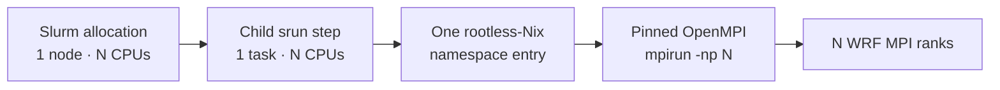

# Validation matrix

This page records what has been empirically exercised, separate from what is
merely implemented or planned.

## Current support boundary

| Capability | Status | Notes |
| --- | --- | --- |
| WRF 4.8.0 build | Validated | Clean `build all --jobs 16` regression completed on Lambda Vector and Sapelo2 |
| WPS 4.7.0 build | Validated | Serial WPS stage completed on Lambda Vector and Sapelo2; `geogrid`, `ungrib`, and `metgrid` installed |
| Rootless Nix on Sapelo2 | Validated | Default single-node profile uses node-local `/lscratch` |
| Static geography staging | Validated | Bundled low-resolution smoke-test geography |
| GFS acquisition/staging | Validated | Fixed GFS smoke window through NOMADS |
| `geogrid -> ungrib -> metgrid` | Validated | `athens-smoke` |
| `real -> wrf` | Validated | Produces WRF input/boundary/output files |
| Single-node interactive MPI | Validated | Tested with 16 and 24 ranks during development |
| Single-node `sbatch` MPI | Validated | 16-rank Sapelo2 run completed successfully |
| One-Nix-namespace Slurm bridge | Validated | Inner OpenMPI launch confirmed in batch |
| Per-run native log archive | Validated | `native-logs.tar` with current-run filtering |
| High-level `wrfctl prep` through `real` | Implemented, not yet regression-validated | Previous prep contract was validated through WRF runtime staging; current contract adds `real`, artifact checks, and a prep manifest |
| `wrfctl plan` / `prep --dry-run` | Implemented, not yet regression-validated | Read-only resolved-science and stage view |
| High-level `wrfctl run` | Implemented, not yet regression-validated | Checks prep freshness, current WRF success marker, and new `wrfout_d01_*` |
| Optional shared `data_root` | Implemented, not yet regression-validated | Reusable geography/GFS may live outside a repository; default remains project-local |
| GFS regional-subset cache identity | Implemented, not yet regression-validated | Cache path includes a request key derived from product and bounding box |
| TOML `case.toml` parser + namelist overlay | Validated | `--check` and managed overlay exercised on Lambda Vector and Sapelo2; unspecified native keys are preserved |
| TOML-driven forcing metadata | Validated | `athens-smoke` GFS date/cycle/hours/subset resolved from `case.toml` and completed acquisition/staging on Lambda Vector and Sapelo2 |
| Multi-node MPI | Not validated | Do not treat as supported research execution |
| WRF restart/recovery workflow | Not validated | Requires dedicated workflow testing |
| Scratch-backed execution workspace | Not implemented | `scratch_root` is currently configuration metadata |
| Full research-grade geography selector | Planned | Current automatic `prep` geography remains low-resolution smoke data |

## Clean build regression

The current build policy was re-tested from a clean generated state with:

```bash
./wrfctl clean
./wrfctl build all --jobs 16
```

The sequence completed successfully on both a standalone Lambda Vector Linux
workstation and a Sapelo2 compute node. In both environments, the final WPS
stage installed `geogrid`, `ungrib`, and `metgrid` and printed
`WPS build completed.`

The Sapelo2 WPS compilation printed compiler warnings while building
`read_geogrid.c`, but those warnings did not stop compilation or installation.
The final completion message, rather than the absence of warnings, is the
build-level success checkpoint.

## TOML + prep orchestration regression

The high-level preparation path was exercised on both the standalone Lambda
Vector system and Sapelo2 with:

```bash
./wrfctl prep --case athens-smoke
```

In both environments, `wrfctl config` reported the tracked native namelists as
unchanged, the low-resolution geography dependency was resolved, the three GFS
forecast hours were acquired from the TOML forcing definition, and
`geogrid`, `ungrib`, and `metgrid` all reported successful completion.
The final stage linked the WRF runtime data and `prep` completed normally.

Sapelo2 printed IEEE floating-point exception flags after `metgrid`, but
`metgrid` still emitted its explicit successful-completion marker and the
pipeline continued to WRF runtime staging. The flags are therefore recorded as
non-fatal output for this smoke regression, not as a clean-output guarantee.

This validated the earlier high-level prep contract through WRF runtime
staging. The current contract additionally runs `real.exe`, verifies
`wrfinput`/`wrfbdy`, writes a preparation manifest, and pairs with
`wrfctl run`; those newly added high-level pieces require a fresh regression.
The result also does not validate other forcing providers, research-grade
static geography, shared `data_root`, or every advanced namelist passthrough.

## Single-node Slurm validation

The validated batch topology is:



A Sapelo2 16-rank batch validation on an Intel Xeon Gold 6130 node completed
with Slurm state `COMPLETED`, exit code `0:0`, and WRF reporting
`SUCCESS COMPLETE WRF`.

The observed wall time of individual smoke runs is intentionally not treated as
a benchmark. Short runs are sensitive to node state, filesystem metadata/cache
state, Nix evaluation caches, and other shared-system effects.

## What "validated" means here

Validated means that the path has been executed end-to-end in the stated
environment and produced the expected program-level result. It does not mean:

- every possible WRF namelist option is supported;
- every HPC site will behave identically;
- the smoke-case scientific configuration is recommended;
- numerical results are scientifically validated for a particular study.

## Validation checklist for a new research case

Before treating a new case as production-ready, confirm the workflow and the
science separately.

Workflow checks:

```text
geogrid completes
ungrib completes
metgrid completes
real creates wrfinput/wrfbdy
wrf reports SUCCESS COMPLETE WRF
expected wrfout files exist
provenance archive exists
```

Scientific checks should be defined by the study: domain adequacy, forcing,
physics, spin-up, stability, expected fields, and comparison against suitable
observations or reference data.
